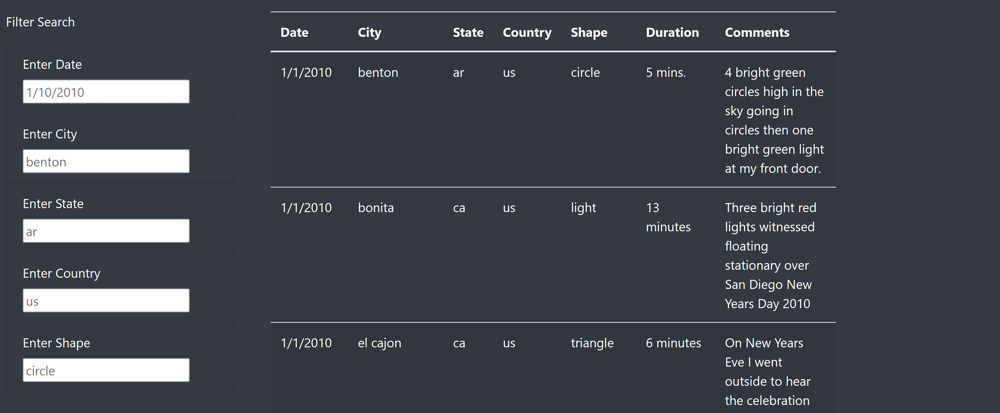
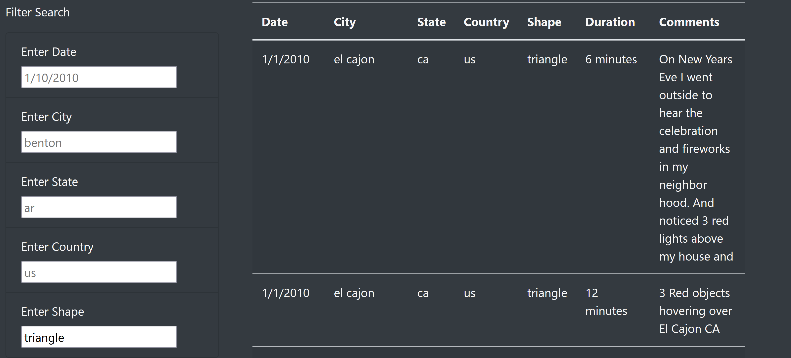
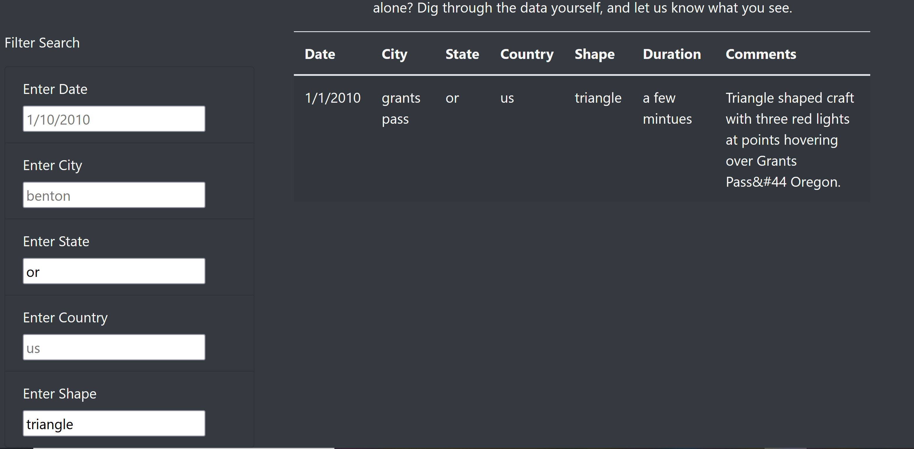

# UFO

## Purpose

The purpose of this project was to to create a webpage and dynamic table to provide information on UFO sightings. We created a table with multiple filters such as date, city, state, country, and shape. 

## Results

The webpage filters for date, city. state , country, and shape. In the previous version the only filter was the date and there was a button
to filter the data. In this version you onlt need to add a criteria for the filters to activate. 

Below is the website without the filters in use:

Now we can filter by shape to narrow down the amount of sightings in the table.
Below we filter by the shape: triangle. 

We can also add more filters on top of shape. We can filter by state and we
find that there is only one UFO sighting in Oregon that is shaped like a triangle. 

## Summary

One drawback of this design is that it does not resize the table for different types of screens (phones, tablets, etc.)

One of two further recommendations is that we can add another filter for duration time.
The second recommendation is to add filters to look for specific words in the comments. 

